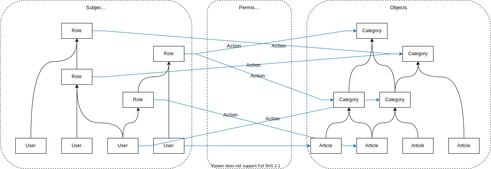

# An RBAC Access Control Library in Golang

The rbac package provides [RBAC (Robe-Based Access Control)](https://en.wikipedia.org/wiki/Role-based_access_control) in a fast, concurrent safe, and easy to use way.

This project is still in developing, and is not considered production ready.

## How it works

## Exported interfaces

### `Grouping`: Role assignment

- assign a role to a subject: the subject can exercise a permission assigned to the role
- assign a higher-level role to a sub-role: roles can be combined in a hierarchy
- it also could be used to group objects together: article-category assignment
- subject-role, article-category groupings are both optional
- when neither of the two is used, RBAC works as [ACL(Access Control List)](https://en.wikipedia.org/wiki/Access-control_list)

### `Permission`: Permission assignment and authorization

- assign a permission: a subject or subjects of a role can perform some action to an article or a category of articles
- authorization: tell if a subject can perform an action to an article

### `Action`: Operations could be done to an object

- preset actions: read, write, execute
- custom actions could be registered through `types.ResetActions()`

### `Persister`s: Persist and coordinate rules among replica set

- store grouping and permission rules to a persisted storage to survive application restarts
- coordinate multiple replicas of the application works together: changes made by any replica will be send to others, and they will behave same as one

## Available persister implementations

For now, there is only a fake Persister implementation used for testings, a mongodb backed Persister is in the plan.
